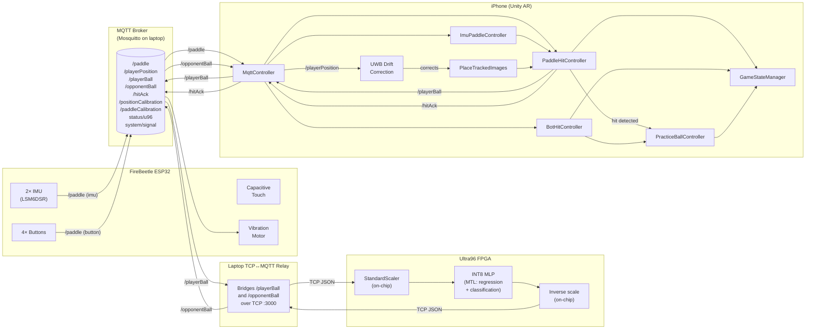
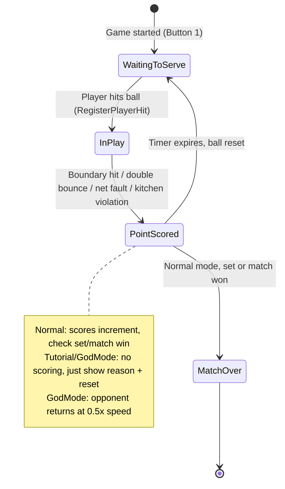
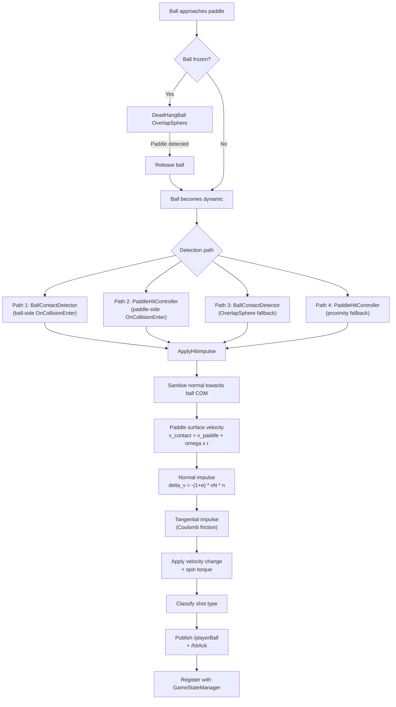
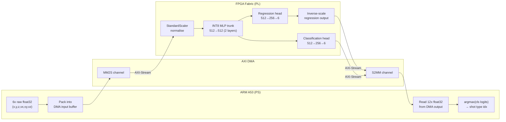

# AR Pickleball: System Architecture

> Concise reference for the integrated capstone project. For hardware details see `CG4002 hardware diagrams.pdf`.

---

## Physical Setup

```
         UWB Anchor A ──────── QR Code (net centre) ──────── UWB Anchor B
              │                       │                            │
              │                 court origin (0,0)                 │
              │                       │                            │
              └────────── physical net line ───────────────────────┘

                               pickleball court
                          (44ft × 20ft standard)

                             player stands here
                        phone on head (VR goggle mount)
                           UWB tag on headset
                       paddle in hand (IMU + QR on face)
```

**Devices (4 nodes):**

| Device | Role | Connection |
|--------|------|------------|
| iPhone (head-mounted) | AR visualiser, game engine | Wi-Fi → MQTT broker |
| FireBeetle ESP32 (on paddle) | 2× IMU, 4 buttons, touch sensor, vibration motor | Wi-Fi → MQTT broker |
| Windows laptop | Mosquitto MQTT broker, TCP↔MQTT relay | Hotspot or LAN |
| Ultra96 FPGA | AI shot prediction (MTL neural network) | TCP :3000 → laptop relay (production) or MQTT+mTLS via SSH tunnel (dev) |

---

## MQTT Topics

| Topic | Direction | QoS | Payload | Purpose |
|-------|-----------|-----|---------|---------|
| `/paddle` | ESP32 → Unity | 1 | `{"type":"imu","position":{"roll","pitch","yaw"},"velocity":{"x","y","z"}}` | IMU orientation + velocity |
| `/paddle` | ESP32 → Unity | 1 | `{"type":"button","button":1-4}` | Hardware button press |
| `/playerBall` | Unity → Ultra96 | 1 | `{"position":{"x","y","z"},"velocity":{"vx","vy","vz"}}` | Ball state after player hit |
| `/opponentBall` | Ultra96 → Unity | 1 | `{"position":{"x","y","z"},"velocity":{"vx","vy","vz"},"returnSwingType":0-5}` | AI-predicted return |
| `/playerPosition` | UWB → Unity | 0 | `{"clientID":"...","position":{"x","y"}}` | Player head position on court |
| `/positionCalibration` | Unity → ESP32 | 1 | `{"isCalibrated":1}` | UWB position calibration ack |
| `/paddleCalibration` | Unity → ESP32 | 1 | `{"isCalibrated":1}` | IMU paddle calibration ack |
| `/hitAck` | Unity → ESP32 | 1 | `{"hit":true}` | Haptic feedback trigger |
| `status/u96` | Ultra96 → broker | 0 | `"READY"` (retained) | Ultra96 readiness status |
| `system/signal` | broker → Ultra96 | 0 | `"START"` | Game start signal |
| `/will` | broker (LWT) | 1 | `"U96 DISCONNECTED"` | Ultra96 disconnection notification |

---

## Ultra96 Communication Modes

Two deployment paths exist between the Ultra96 and the MQTT broker:

**Production (TCP relay):** The Ultra96 runs a TCP server on port 3000. A relay process on the laptop bridges MQTT ↔ TCP: it subscribes to `/playerBall`, forwards each payload over TCP to the Ultra96, reads the response, and publishes to `/opponentBall`. The Ultra96 handles scaling and inference on-chip; the relay is a dumb pipe.

**Development (MQTT+mTLS direct):** The Ultra96 connects directly to the Mosquitto broker at `127.0.0.1:8883` via an SSH tunnel. It subscribes to `/playerBall`, runs FPGA inference locally, and publishes `/opponentBall`. Uses mTLS with per-client certificates. Also subscribes to `system/signal` for game start gating and publishes `status/u96` on connect.

---

## Button Mapping (ESP32 hardware buttons)

| Button | Action |
|--------|--------|
| 1 | Start / Pause / Resume |
| 2 | Full Reset + Calibrate (resets gameplay/ball/court/paddle, re-scans QR, calibrates UWB + IMU) |
| 3 | Reset Ball |
| 4 | Cycle Mode (pre-game) / Full Reset (in-game) |

---

## Game Modes

| Mode | Scoring | Match End | Opponent Ball Speed | Display |
|------|---------|-----------|---------------------|---------|
| Normal | Full (11-pt sets, best-of-3) | Yes | 1.0× | Score + sets |
| Tutorial | None | Never | 1.0× | "Practice Mode, no scoring" |
| God Mode | None | Never | 0.5× | "God Mode, no scoring" |

---

## Coordinate Systems

The AI model is trained on synthetic data generated in Unity's coordinate frame. Both the model and the MQTT wire format use the same convention:

```
AI Model / MQTT wire / Unity:
  x = lateral (right)       [-3.5, 3.5]   centre = 0
  y = height  (up)          [0, ~10]      0 = court surface
  z = depth   (forward)     [-4, 12]      net at z = 4
```

No coordinate transformation is performed on the Ultra96 side; `(x, y, z, vx, vy, vz)` passes directly between the MQTT payload and the FPGA predictor. Any world-to-game-space conversion (via `gameSpaceRoot.TransformPoint/InverseTransformPoint`) happens inside the Unity MqttController before serialisation.

---

## AI Model Details

**Architecture:** Multi-task learning (MTL) network. Shared FC trunk feeds two independent heads.

```
Input(6) → Linear(6→512) → ReLU6 → Dropout(0.0006)
         → Linear(512→512) → ReLU6 → Dropout(0.0006)
         ├─ Regression head:     Linear(512→256) → ReLU6 → Linear(256→6)
         └─ Classification head: Linear(512→256) → ReLU6 → Linear(256→6)
```

Key details:

| Property | Value |
|----------|-------|
| Input | 6D ball state (x, y, z, vx, vy, vz) |
| Regression output | 6D racket target state (x, y, z, vx, vy, vz) |
| Classification output | 6 shot types (Drive, Drop, Dink, Lob, SpeedUp, HandBattle) |
| Hidden dim | 512 |
| Hidden layers | 2 (shared trunk) |
| Activation | ReLU6 (clamped to [0, 6] for HLS fixed-point) |
| Batch normalisation | Disabled in final model |
| Dropout | 0.0006 |
| Optimiser | AdamW (lr = 9.73e-4, weight decay = 2.32e-5) |
| Regression loss | MSE (weighted × 1.43) |
| Classification loss | Cross-entropy (weighted × 0.44) |
| Best epoch | 74 / 1000 (early stopping checkpoint) |
| Quantisation | INT8 symmetric per-tensor (for HLS deployment) |

**Final model performance (test set):**

| Metric | Value |
|--------|-------|
| Classification F1 | 0.928 |
| Classification accuracy | 0.955 |
| Normalised MAE (regression) | 0.070 |

Note: the Optuna Pareto-front trial reports F1 = 0.942 / MAE = 0.078; the numbers above are from the actual final trained model checkpoint.

**FPGA inference pipeline:**

```
PS packs 6 raw float32 → AXI DMA MM2S → AXI-Stream → HLS IP (pb_predict)
  FPGA on-chip: StandardScaler normalisation → INT8 MLP → inverse-scale regression output
AXI-Stream → AXI DMA S2MM → PS reads 12 float32 (6 regression + 6 classification logits)
PS: argmax on classification logits → shot type index
```

The FPGA handles input scaling, inference, and output inverse-scaling entirely on-chip. The PS (ARM A53) only packs raw sensor values, triggers DMA, and reads results.

**Dataset pipeline:**

1. Generate synthetic shots via physics simulation (drag, Magnus, bounce) matching Unity's BallAerodynamics and PaddleHitController parameters
2. Apply StandardScaler normalisation and 70/15/15 stratified split
3. Run multi-objective Optuna hyperparameter search (300 trials, Pareto on MAE vs F1)
4. Train final model with best balanced hyperparameters
5. Export INT8 quantised weights as C headers for HLS synthesis

---

## Paddle Control Priority

```
1. Fresh QR + IMU    → QR position, IMU rotation/velocity (auto-calibrates IMU-to-world offset)
2. Stale QR + IMU    → last QR pos + v·dt + swing arc, IMU world rotation (QR-calibrated)
3. IMU-only          → camera anchor + IMU displacement
4. Fresh QR only     → QR position/rotation, finite-diff velocity
5. Stale QR only     → freeze at last QR position
6. Camera fallback   → mouse/touch position
```

**IMU-to-world alignment**: While QR is active, every frame learns `imuToWorldOffset = qrWorldRotation × Inverse(calibratedIMU)`. When QR is lost, this frozen offset correctly maps IMU yaw to court space.

**Stale mode formula** (rotation computed first for correct lever arm):
```
staleRotation  = imuToWorldOffset × calibratedIMU              // world-space orientation (first!)
stalePosition += paddleVelocity × dt                           // ESP32 linear velocity
leverArm       = staleRotation × forward × 0.3m               // current-frame forward direction
stalePosition += Cross(angularVelocity, leverArm) × dt        // swing arc (30cm lever arm)
```

---

## UWB Drift Correction

UWB tag on the player's head provides absolute position on the court. Each frame:

1. Compute where AR thinks the camera is: `gameSpaceRoot.InverseTransformPoint(cameraWorldPos)`
2. Compare X/Z with UWB court-local position
3. If drift > 5cm threshold, nudge `gameSpaceRoot.position` (0.3/sec, max 2cm/frame)

This corrects AR camera drift without fighting ARKit. Everything under GameSpaceRoot (court, ball, bot) moves with the correction.

---

## Scene Hierarchy

```
Root
├── MqttReceiver          — MQTT client (MqttReceiver, MqttController)
├── AR Session            — ARKit session
├── PlayerPaddle          — Physics paddle (PaddleHitController, ImuPaddleController)
├── XR Origin (AR Rig)    — AR camera + ARPlaneGameSpacePlacer
│   └── Camera Offset
│       └── Main Camera   — StereoscopicAR
├── GameFlowManager       — GameStateManager, CourtBoundarySetup, ScoreboardUI
├── GameSpaceRoot         — Court anchor (placed by QR + AR plane)
│   ├── pickleball court  — Court model
│   ├── Ball2             — Ball (PracticeBallController, DeadHangBall, BallContactDetector, BallAerodynamics)
│   ├── Bot               — AI opponent (BotHitController, BotShotProfile)
│   ├── walls             — Court boundaries (CourtBoundary tags)
│   └── BotAimTarget      — 3 target positions for bot shots
├── Canvas                — Debug UI
└── EventSystem           — Input
```

---

## Architecture Diagrams

### Data Flow: Sensor to Physics



### State Machine: Game Flow



### Paddle Control Mode Transitions


### Hit Detection Pipeline



### FPGA Inference Pipeline

