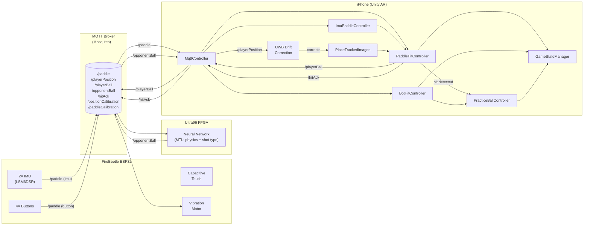
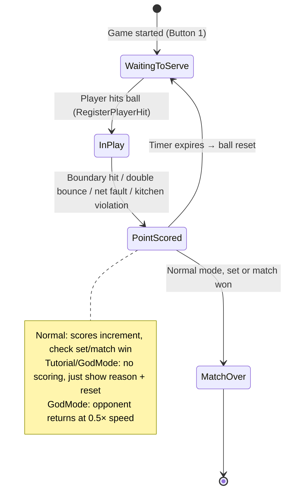
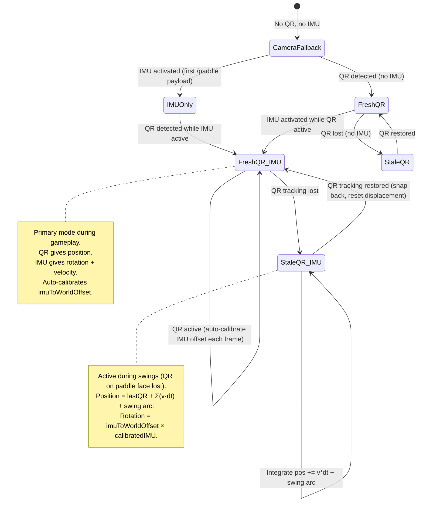
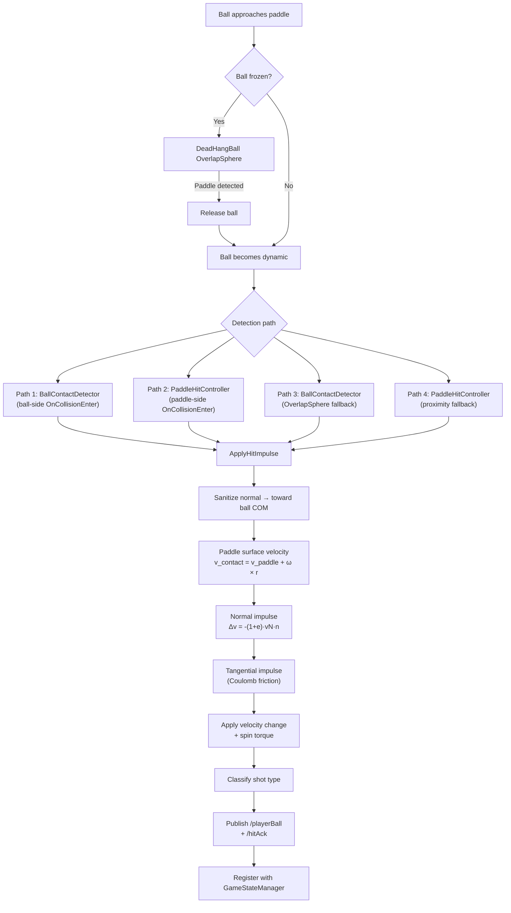

# AR Pickleball — System Architecture

> Concise reference for the integrated capstone project. For hardware details see `CG4002 hardware diagrams.pdf`. For AI model details see `B03_CG4002_Initial_Design_Report.docx.pdf`.

---

## Physical Setup

```
         UWB Anchor A ──────── QR Code (net center) ──────── UWB Anchor B
              │                       │                            │
              │                 court origin (0,0)                 │
              │                       │                            │
              └────────── physical net line ───────────────────────┘

                               pickleball court
                          (44ft × 20ft standard)

                             player stands here
                        phone on head (VR goggle mount)
                           UWB tag on headset
                       paddle in hand (IMU + QR on face)
```

**Devices (4 nodes):**

| Device | Role | Connection |
|--------|------|------------|
| iPhone (head-mounted) | AR visualizer, game engine | Wi-Fi → MQTT broker |
| FireBeetle ESP32 (on paddle) | 2× IMU, 4 buttons, touch sensor, vibration motor | Wi-Fi → MQTT broker |
| Windows laptop | Mosquitto MQTT broker, relay | Hotspot or LAN |
| Ultra96 FPGA | AI shot prediction (neural network) | SSH tunnel → laptop |

---

## MQTT Topics

| Topic | Direction | QoS | Payload | Purpose |
|-------|-----------|-----|---------|---------|
| `/paddle` | ESP32 → Unity | 1 | `{"type":"imu","position":{"roll","pitch","yaw"},"velocity":{"x","y","z"}}` | IMU orientation + velocity |
| `/paddle` | ESP32 → Unity | 1 | `{"type":"button","button":1-4}` | Hardware button press |
| `/playerBall` | Unity → Ultra96 | 1 | `{"position":{"x","y","z"},"velocity":{"vx","vy","vz"}}` | Ball state after player hit |
| `/opponentBall` | Ultra96 → Unity | 1 | `{"position":{"x","y","z"},"velocity":{"vx","vy","vz"},"returnSwingType":0-5}` | AI-predicted return |
| `/playerPosition` | UWB → Unity | 0 | `{"clientID":"...","position":{"x","y"}}` | Player head position on court |
| `/positionCalibration` | Unity → ESP32 | 1 | `{"isCalibrated":1}` | UWB position calibration ack |
| `/paddleCalibration` | Unity → ESP32 | 1 | `{"isCalibrated":1}` | IMU paddle calibration ack |
| `/hitAck` | Unity → ESP32 | 1 | `{"hit":true}` | Haptic feedback trigger |

---

## Button Mapping (ESP32 hardware buttons)

| Button | Action |
|--------|--------|
| 1 | Start / Pause / Resume |
| 2 | Full Reset + Calibrate (resets gameplay/ball/court/paddle, re-scans QR, calibrates UWB + IMU) |
| 3 | Reset Ball |
| 4 | Cycle Mode (pre-game) / Full Reset (in-game) |

---

## Game Modes

| Mode | Scoring | Match End | Opponent Ball Speed | Display |
|------|---------|-----------|---------------------|---------|
| Normal | Full (11-pt sets, best-of-3) | Yes | 1.0× | Score + sets |
| Tutorial | None | Never | 1.0× | "Practice Mode — no scoring" |
| God Mode | None | Never | 0.5× | "God Mode — no scoring" |

---

## Coordinate Systems

```
AI Model (Ultra96):          Unity:                  Conversion:
  x = lateral (right)         x = right               x = x
  y = depth (forward)         y = up                  y ↔ z swap
  z = height (up)             z = forward
```

All MQTT spatial data is converted at the `MqttController` boundary via `gameSpaceRoot.TransformPoint/InverseTransformPoint` with y↔z swap.

---

## Paddle Control Priority

```
1. Fresh QR + IMU    → QR position, IMU rotation/velocity (auto-calibrates IMU-to-world offset)
2. Stale QR + IMU    → last QR pos + v·dt + swing arc, IMU world rotation (QR-calibrated)
3. IMU-only          → camera anchor + IMU displacement
4. Fresh QR only     → QR position/rotation, finite-diff velocity
5. Stale QR only     → freeze at last QR position
6. Camera fallback   → mouse/touch position
```

**IMU-to-world alignment**: While QR is active, every frame learns `imuToWorldOffset = qrWorldRotation × Inverse(calibratedIMU)`. When QR is lost, this frozen offset correctly maps IMU yaw to court space.

**Stale mode formula** (rotation computed first for correct lever arm):
```
staleRotation  = imuToWorldOffset × calibratedIMU              // world-space orientation (first!)
stalePosition += paddleVelocity × dt                           // ESP32 linear velocity
leverArm       = staleRotation × forward × 0.3m               // current-frame forward direction
stalePosition += Cross(angularVelocity, leverArm) × dt        // swing arc (30cm lever arm)
```

---

## UWB Drift Correction

UWB tag on the player's head provides absolute position on the court. Each frame:

1. Compute where AR thinks the camera is: `gameSpaceRoot.InverseTransformPoint(cameraWorldPos)`
2. Compare X/Z with UWB court-local position
3. If drift > 5cm threshold, nudge `gameSpaceRoot.position` (0.3/sec, max 2cm/frame)

This corrects AR camera drift without fighting ARKit. Everything under GameSpaceRoot (court, ball, bot) moves with the correction.

---

## Scene Hierarchy

```
Root
├── MqttReceiver          — MQTT client (MqttReceiver, MqttController)
├── AR Session            — ARKit session
├── PlayerPaddle          — Physics paddle (PaddleHitController, ImuPaddleController)
├── XR Origin (AR Rig)    — AR camera + ARPlaneGameSpacePlacer
│   └── Camera Offset
│       └── Main Camera   — StereoscopicAR
├── GameFlowManager       — GameStateManager, CourtBoundarySetup, ScoreboardUI
├── GameSpaceRoot         — Court anchor (placed by QR + AR plane)
│   ├── pickleball court  — Court model
│   ├── Ball2             — Ball (PracticeBallController, DeadHangBall, BallContactDetector, BallAerodynamics)
│   ├── Bot               — AI opponent (BotHitController, BotShotProfile)
│   ├── walls             — Court boundaries (CourtBoundary tags)
│   └── BotAimTarget      — 3 target positions for bot shots
├── Canvas                — Debug UI
└── EventSystem           — Input
```

---

## Architecture Diagrams

### Data Flow — Sensor to Physics



### State Machine — Game Flow



### Paddle Control Mode Transitions



### Hit Detection Pipeline


