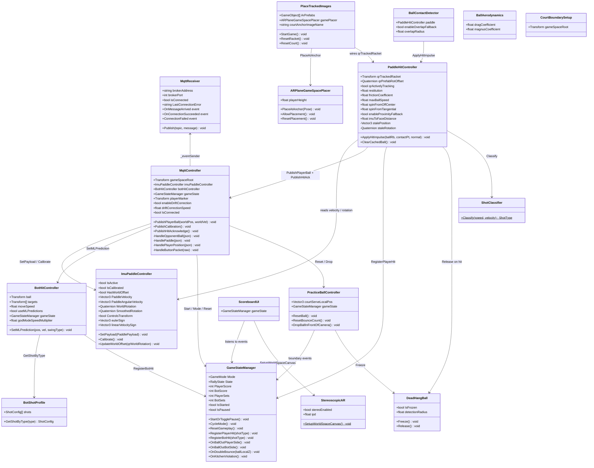
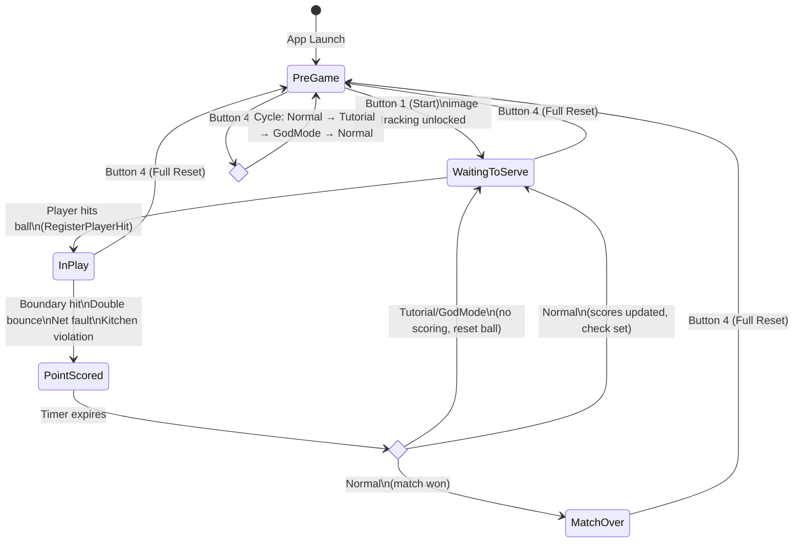
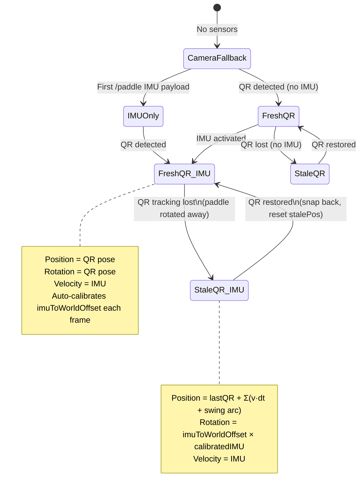
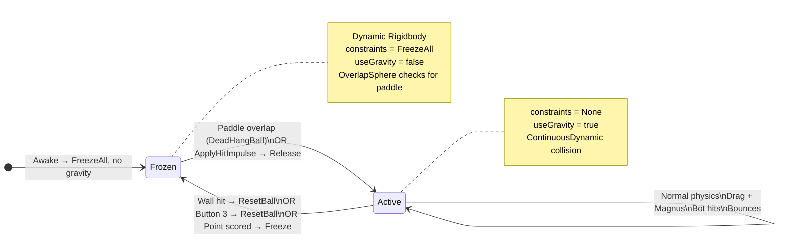
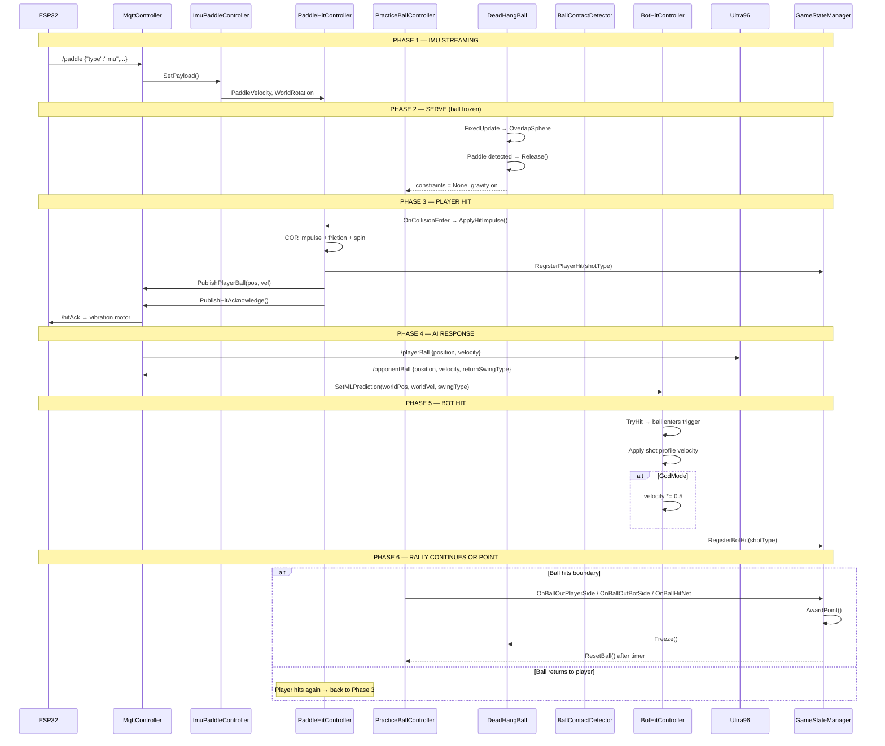
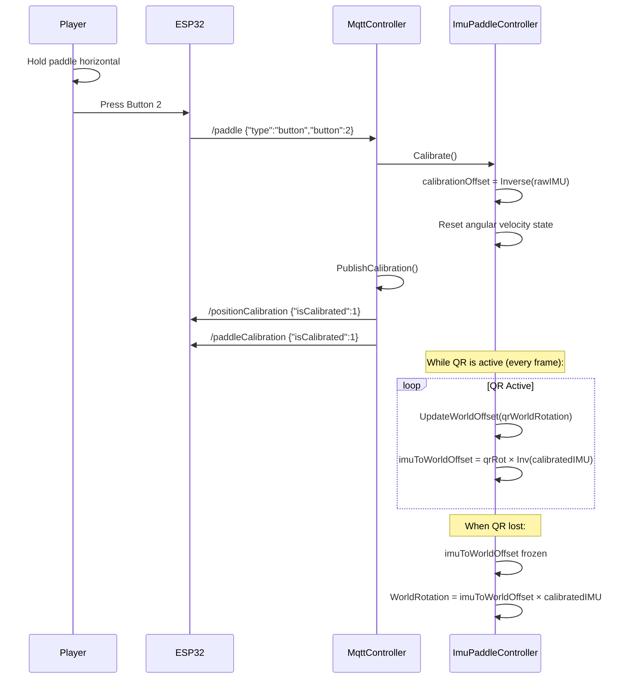
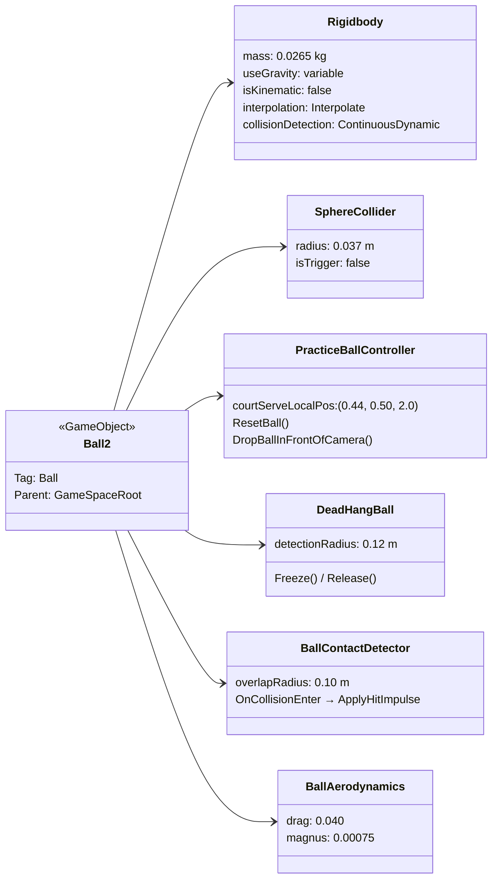
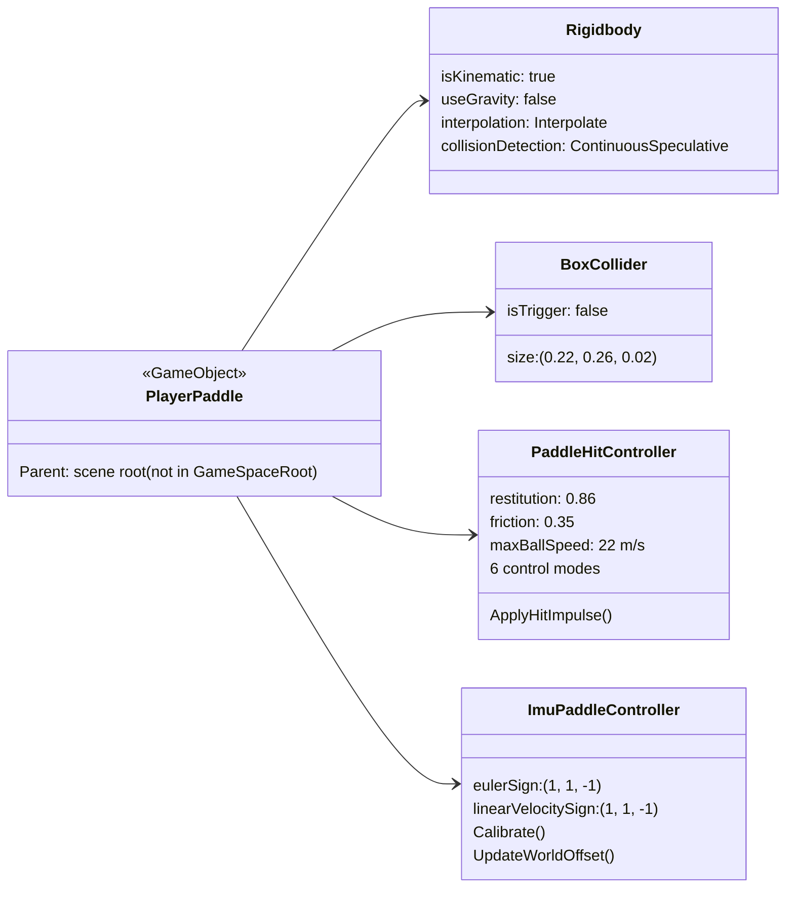
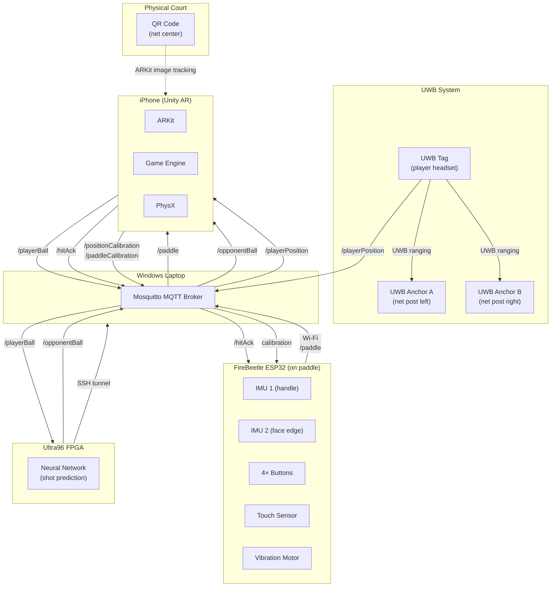
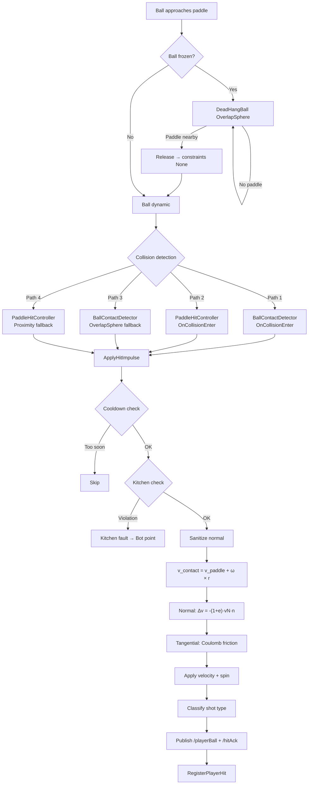

# AR Pickleball — UML Diagrams

> Render with any Mermaid-compatible viewer (GitHub, VS Code extension, Mermaid Live Editor).

---

## 1. Class Diagram — Full System

---

## 2. State Machine — Game Flow

---

## 3. State Machine — Paddle Control Modes

---

## 4. State Machine — Ball Physics

---

## 5. Sequence Diagram — Full Rally Cycle

---

## 6. Sequence Diagram — IMU Calibration

---

## 7. Component Diagram — Ball GameObject (Ball2)

---

## 8. Component Diagram — PlayerPaddle

---

## 9. Deployment Diagram — Multi-Device Architecture

---

## 10. Activity Diagram — Hit Detection Pipeline

