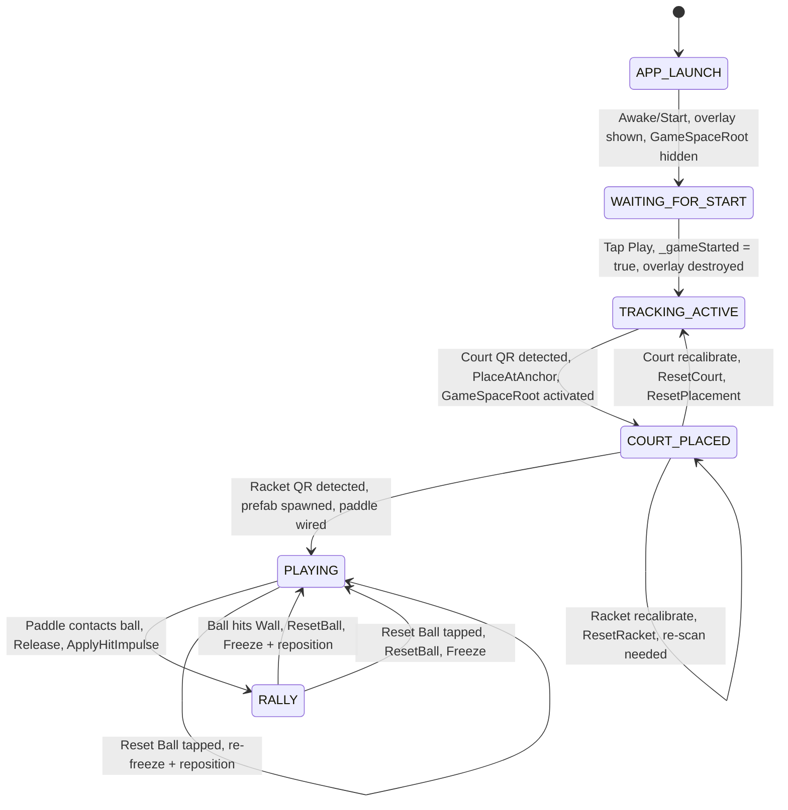
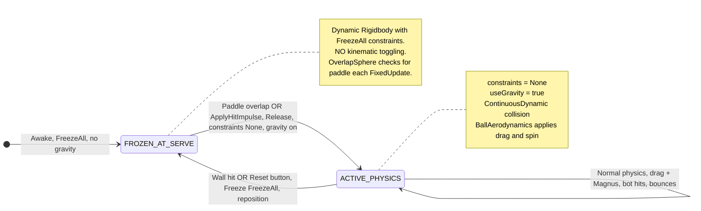
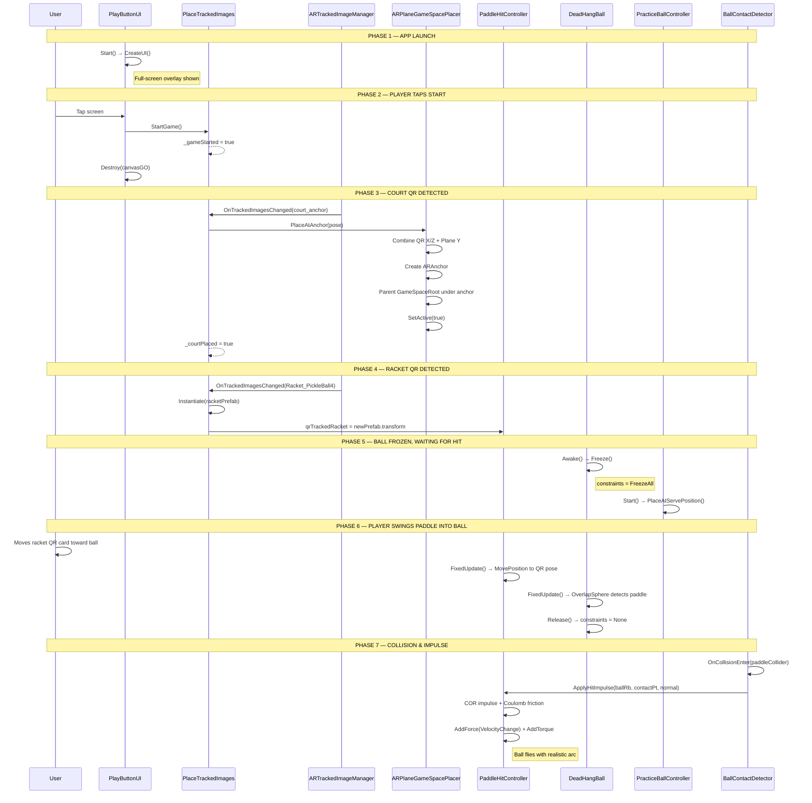
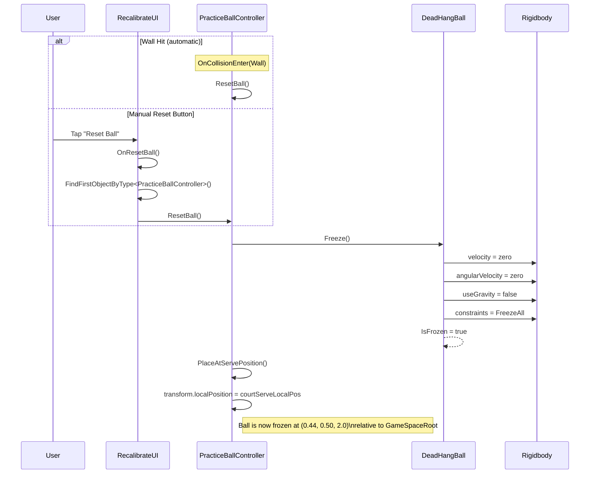
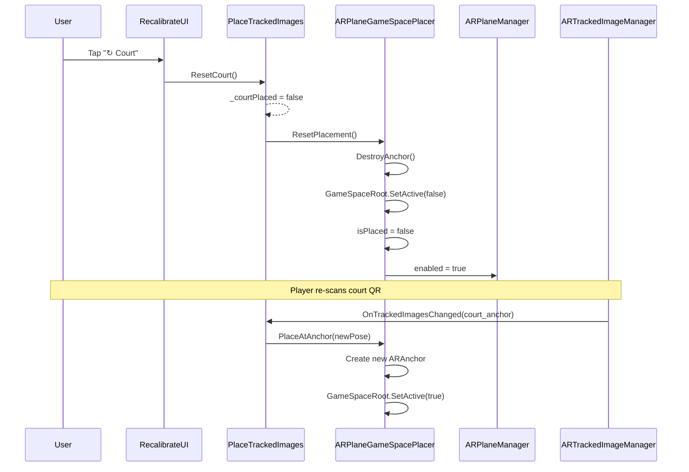
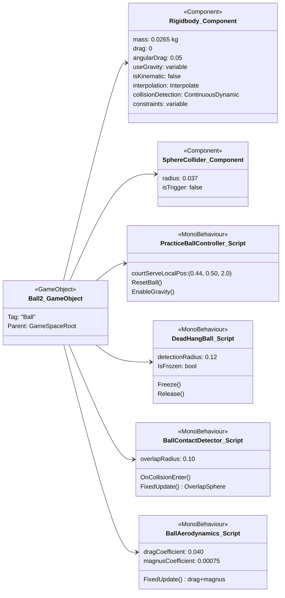
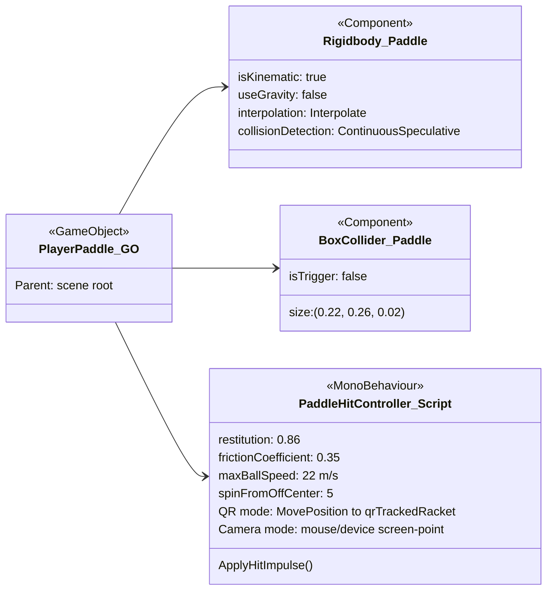
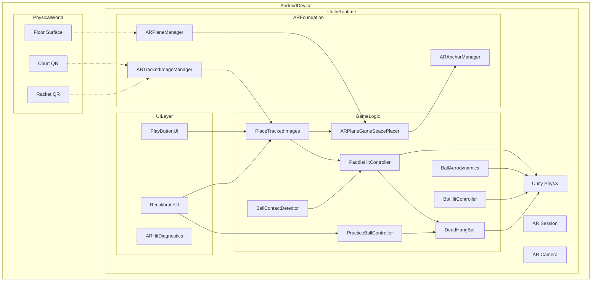
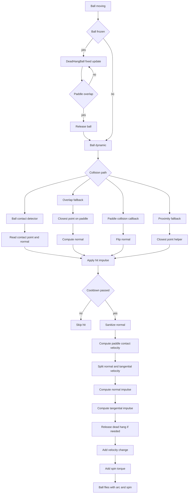

# Capstone AR Pickleball — UML Diagrams

> Render these with any Mermaid-compatible viewer (GitHub, Mermaid Live Editor, VS Code extension).

---

## 1. Class Diagram — Full System

```mermaid
classDiagram
    direction TB

    class PlaceTrackedImages {
        -ARTrackedImageManager _trackedImagesManager
        -Dictionary~string,GameObject~ _instantiatedPrefabs
        -bool _courtPlaced
        -bool _gameStarted
        +GameObject[] ArPrefabs
        +ARPlaneGameSpacePlacer gamePlacer
        +string courtAnchorImageName
        +StartGame() void
        +ResetRacket() void
        +ResetCourt() void
        -OnTrackedImagesChanged(ARTrackedImagesChangedEventArgs) void
        -ProcessTrackedImages(IReadOnlyList~ARTrackedImage~) void
    }

    class ARPlaneGameSpacePlacer {
        -Transform gameSpaceRoot
        -ARPlaneManager planeManager
        -ARRaycastManager raycastManager
        -Camera arCamera
        -ARAnchorManager _anchorManager
        -GameObject _anchorGO
        -bool isPlaced
        -bool isAllowed
        -float _floorY
        -bool _hasFloorY
        -Pose? pendingPlanePose
        +bool hideGameSpaceUntilPlaced
        +float playerHeight
        +PlaceAtAnchor(Pose) void
        +AllowPlacement() void
        +ResetPlacement() void
        -PlaceGameSpace(Vector3, Quaternion) void
        -FinalizePlace(Vector3, Quaternion) void
        -GetClosestHorizontalPlane(Vector3) ARPlane
        -CreateFreeAnchor(Pose) void
        -DestroyAnchor() void
    }

    class PlayButtonUI {
        -ARPlaneGameSpacePlacer gamePlacer
        -GameObject canvasGO
        +string buttonText
        +int fontSize
        -CreateUI() void
        -OnPlayPressed() void
    }

    class PaddleHitController {
        +Transform cameraTransform
        +Transform qrTrackedRacket
        +float restitution
        +float frictionCoefficient
        +float maxBallSpeed
        +float spinFromOffCenter
        +float spinFromTangential
        +float hitCooldown
        +Rigidbody trackedBall
        +bool enableProximityFallback
        +float proximityHitDistance
        +bool useMouseInEditor
        -Rigidbody paddleRigidbody
        -Collider[] paddleColliders
        -Vector3 paddleVelocity
        -Vector3 paddleAngularVelocity
        -float lastHitTime
        +ApplyHitImpulse(Rigidbody, Vector3, Vector3) void
        -FixedUpdate() void
        -TryProximityHit() void
        -HandlePaddleCollision(Collision) void
        -GetTargetWorldPosition() Vector3
        -GetTargetWorldRotation(Vector3) Quaternion
    }

    class BallContactDetector {
        +PaddleHitController paddle
        +bool enableOverlapFallback
        +float overlapRadius
        -Rigidbody ballRigidbody
        -Collider[] paddleColliders
        -OnCollisionEnter(Collision) void
        -OnCollisionStay(Collision) void
        -HandleCollision(Collision) void
        -FixedUpdate() void
        -IsPaddleCollider(Collider) bool
    }

    class DeadHangBall {
        +PaddleHitController paddle
        +float detectionRadius
        +bool IsFrozen
        -Rigidbody rb
        -Collider[] paddleColliders
        +Freeze() void
        +Release() void
        -FixedUpdate() void
        -CachePaddleColliders() void
        -IsPaddleCollider(Collider) bool
    }

    class PracticeBallController {
        +Transform servePoint
        +Vector3 courtServeLocalPos
        +bool createGroundPlane
        +KeyCode resetKey
        +bool IsFrozen
        -Rigidbody ballRigidbody
        -Vector3 initialLocalPosition
        -Transform gameSpaceRoot
        -DeadHangBall deadHang
        +ResetBall() void
        +EnableGravity() void
        -PlaceAtServePosition() void
        -EnsureGroundCollider() void
        -OnCollisionEnter(Collision) void
    }

    class BallAerodynamics {
        +float ballMass
        +float dragCoefficient
        +float magnusCoefficient
        +float maxAngularSpeed
        -Rigidbody ballRigidbody
        -FixedUpdate() void
    }

    class BotHitController {
        +Transform ball
        +Transform[] targets
        +float moveSpeed
        +float hitCooldown
        -BotShotProfile shotProfile
        -Animator animator
        -Vector3 startPosition
        -float lastHitTime
        -TrackBall() void
        -TryHit(Collider) void
        -PickTarget() Vector3
        -PickShot() ShotConfig
        -PlayHitAnimation() void
    }

    class BotShotProfile {
        +ShotConfig topSpin
        +ShotConfig flat
    }

    class ShotConfig {
        <<struct>>
        +float upForce
        +float hitForce
    }

    class BotTargeting {
        +Transform ball
        +Transform aimTarget
        +Transform[] targets
        +bool autoAimAtBall
        +float turnSpeed
    }

    class RecalibrateUI {
        -PlaceTrackedImages imageTracker
        -GameObject _canvasGO
        -PracticeBallController _ballController
        -CreateUI() void
        -OnResetBall() void
        -OnCourtRecalibrate() void
        -OnRacketRecalibrate() void
    }

    class ARTrackedPaddleMapper {
        -Transform paddlePivot
        -Transform visualRoot
        -Vector3 localPositionOffset
        -Vector3 localEulerOffset
        -ARTrackedImage trackedImage
        -ApplyCurrentOffsets() void
        -HandleCalibrationHotkeys() void
    }

    class ARPaddleCalibrationOverlay {
        -ARTrackedPaddleMapper mapper
        -OnGUI() void
    }

    class ARHitDiagnostics {
        -PaddleHitController physicsPaddle
        -BallContactDetector ballDetector
        -Transform ballTransform
        -Transform qrRacketTransform
        +float logIntervalSeconds
        +bool showOnScreenHUD
        +bool autoFixIssues
        -int hitCount
        -Discover() void
        -OnGUI() void
    }

    class POVStartRotationReset {
        +bool lockRollAndPitchInUpdate
    }

    %% Relationships

    PlaceTrackedImages --> ARPlaneGameSpacePlacer : gamePlacer\nPlaceAtAnchor()
    PlaceTrackedImages --> PaddleHitController : wires qrTrackedRacket
    PlayButtonUI --> PlaceTrackedImages : StartGame()
    PlayButtonUI --> ARPlaneGameSpacePlacer : gamePlacer ref

    RecalibrateUI --> PlaceTrackedImages : ResetRacket()\nResetCourt()
    RecalibrateUI --> PracticeBallController : ResetBall()

    PracticeBallController --> DeadHangBall : Freeze()\nRelease()
    BallContactDetector --> PaddleHitController : ApplyHitImpulse()
    DeadHangBall --> PaddleHitController : paddle ref\nOverlapSphere detection
    PaddleHitController --> DeadHangBall : Release() on hit

    BotHitController --> BotShotProfile : PickShot()
    BotShotProfile --> ShotConfig : contains
    BotHitController --> BotTargeting : same GO

    ARPaddleCalibrationOverlay --> ARTrackedPaddleMapper : mapper

    ARHitDiagnostics ..> PaddleHitController : discovers
    ARHitDiagnostics ..> BallContactDetector : discovers
```

---

## 2. State Machine Diagram — Application Lifecycle

---

## 3. State Machine Diagram — Ball Physics States

---

## 4. Sequence Diagram — Game Start to First Hit

---

## 5. Sequence Diagram — Ball Reset Flow

---

## 6. Sequence Diagram — Court Recalibration

---

## 7. Component Diagram — Ball GameObject

---

## 8. Component Diagram — Paddle (PlayerPaddle) GameObject

---

## 9. Deployment Diagram — AR System Architecture

---

## 10. Activity Diagram — Hit Detection Pipeline

